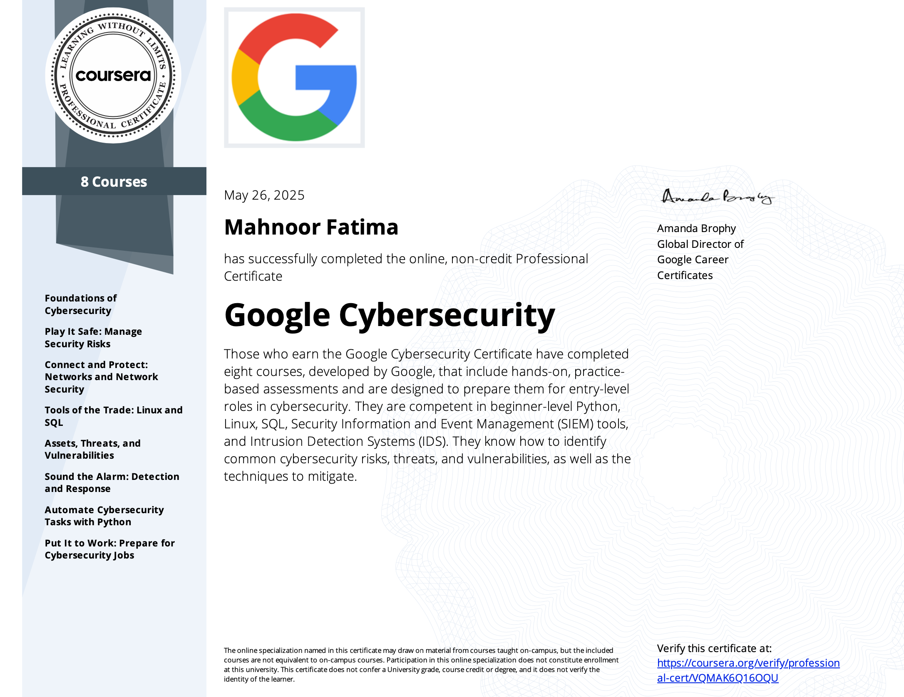
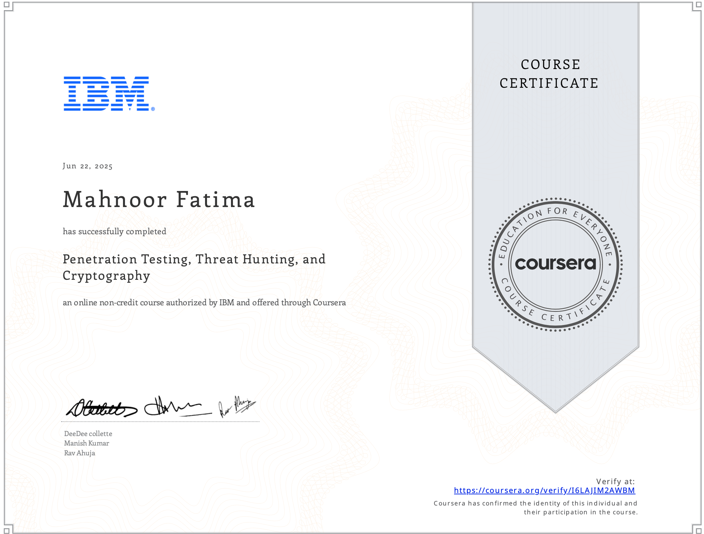
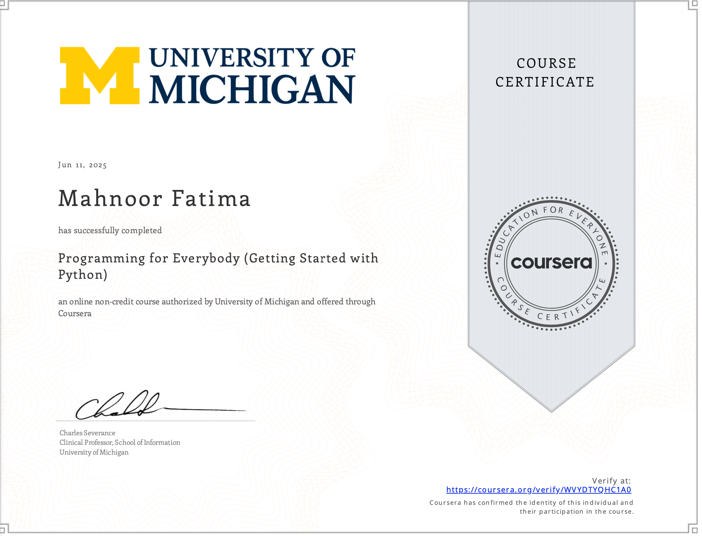
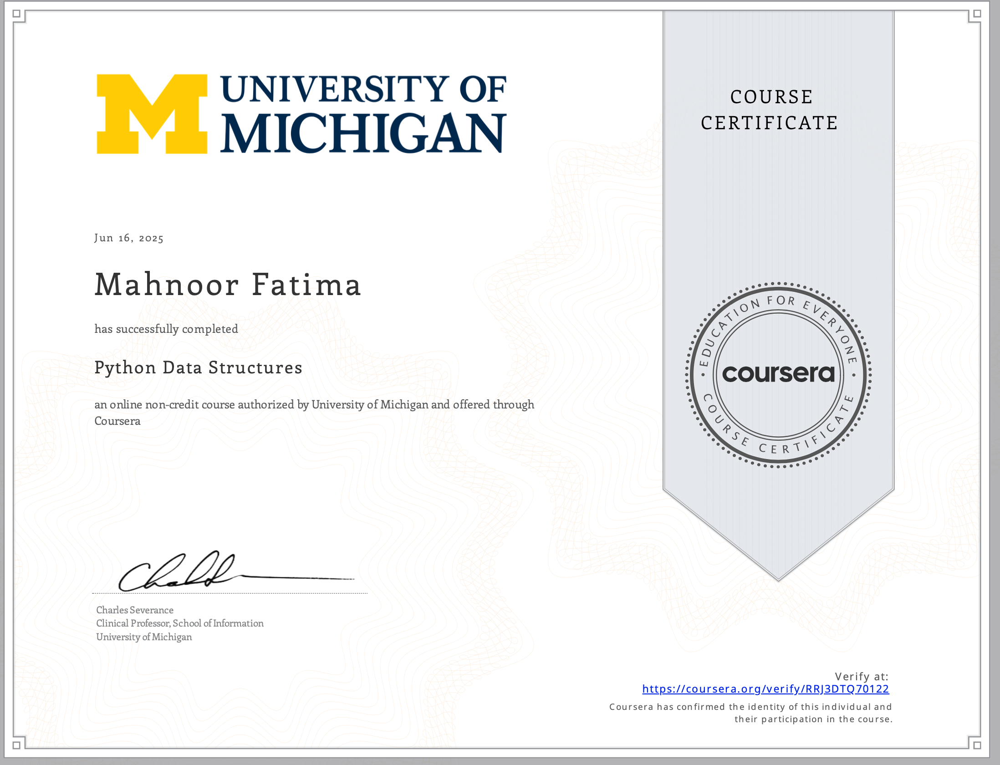
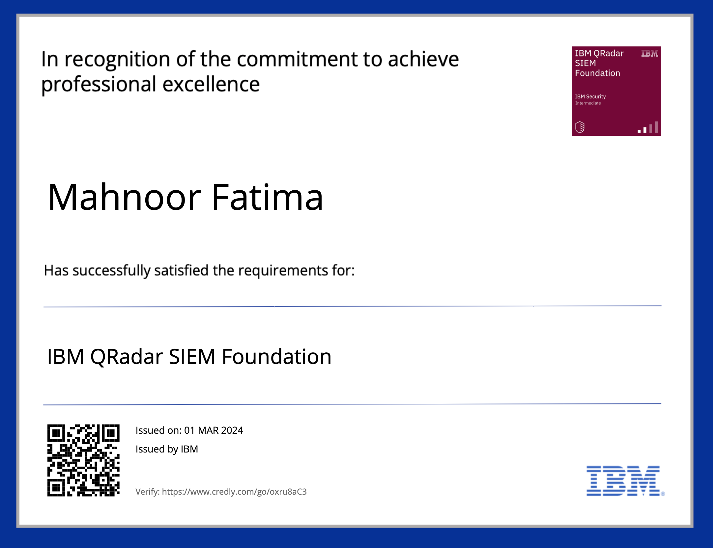

# 🛡️ Mahnoor Fatima | Cybersecurity Analyst

🎯 Entry-level Cybersecurity Analyst with practical SOC experience in threat monitoring, incident response, and threat intelligence. Skilled with SIEM tools (QRadar, Wazuh, Splunk), Linux security, and beginner-level Python scripting, Currently seeking opportunities to contribute to blue teams and security operations in a real-world environment.

---

## 🧰 Tech Stack & Tools

🔍 **SIEM & Monitoring**: `IBM QRadar`, `Wazuh`, `Elastic Stack`, `Splunk`  
🌐 **Threat Intelligence**: `VirusTotal`, `AlienVault OTX`, `RiskIQ`, `IPDP`, `X-Force`  
🐧 **Linux Security**: `Ubuntu CLI`, `Permissions`, `iptables`, `netstat`, `auditd`, `bash scripting`  
🐍 **Programming & Scripting**: `Python`, `SQL`, `Bash`  
🧪 **Pen Testing & Tools**: `Nmap`, `Wireshark`, `Nslookup`, `OpenVAS`, `Google Dorking`  
🔐 **Security Concepts**: `CIA Triad`, `NIST Framework`, `XDR`, `SIEM Alerts`, `IOC Management`, `Encryption`, `Phishing Detection`

---

## 📂 Projects & Tasks (SOC Analyst Training – Trillium)

🔐 *Note: Due to confidentiality agreements, internal projects are not shared publicly. Below is a general overview of my training experience.*

### 🔍 Security Event Monitoring
- Monitored and analyzed logs using **IBM QRadar** and **Wazuh**
- Conducted alert triage and reviewed suspicious activities across endpoints

### 🛡️ Threat Intelligence & IOC Verification
- Investigated domains and IPs via **VirusTotal**, **AlienVault**, **RiskIQ**, and **IPDP**
- Reduced false positives by cross-verifying multiple threat intelligence feeds

### 🚨 Incident Response & Escalation
- Followed IR workflows to classify and escalate events using predefined playbooks
- Documented incident summaries and handed off escalations to senior analysts

### 📊 Reporting & Documentation
- Prepared detailed daily, weekly, and monthly reports on threat patterns
- Contributed to documentation of incident resolution timelines and actions taken

### 🔐 Access Control & Blacklist Filtering
- Applied threat feed rules to block malicious IPs/domains using firewall-level controls
- Worked with XDR interfaces to track asset activity and isolate risky behavior

---

## 🎓 Course-Based Projects & Labs

### 📘 Google Cybersecurity Certificate 

- 🛡️ **Incident Response Simulation**: Analyzed mock breaches and created response plans
- 📊 **SIEM & Log Analysis**: Worked with simulated logs to investigate anomalies

📁 [Browse all SplunkLab images](./img/SplunkLab/)
- 🐧 **Linux CLI & Security**: Navigated file systems, permissions, user roles, and system hardening

📁 [Browse all LinuxLab images](./LinuxLab/)
- 🐍 **Python for Security**: Wrote scripts to parse logs, check IPs, and automate alerts
 
📁 [Browse all PythonLab images](./img/PythonLab/)
- 🧮 **SQL for Cybersecurity**: Queried mock datasets for suspicious login behavior

📁 [Browse all MariaDBLabs images](./img/MariaDBLabs/)
### 🧪 IBM Penetration Testing, Threat Hunting & Cryptography 

- 🔍 **Reconnaissance Labs**: Active/passive scanning with `Nmap`, `Nslookup`, Google Dorking and Wireshark

📁 [Browse all NmapLab images](./img/NmapLab/)

📁 [Browse all NsLookupLab images](./img/NsLookupLabs/)

📁 [Browse all WiresharkLab images](./img/WiresharkLab/)

📁 [Browse all VulnerabilityResearchLab images](./img/VulnerabilityResearchLabs/)

- 🐛 **Vulnerability Discovery**: Simulated scanning with `OpenVAS`, interpreted CVEs
- 🎯 **Social Engineering Simulation**: Mock phishing emails, payload structure, pretexting
- 🔐 **Crypto Basics**: Hands-on with hashing, encryption, encoding, and decryption in linux

📁 [Browse all CryptoLab images](./img/CryptoLab/)

---

## 🏅 Certifications

- 🎓 **Google Cybersecurity Professional Certificate**

- 🧠 ** IBM Pen Testing, Threat Hunting & Cryptography**  

- 🐍 **Python for Everybody** – UNIVERSITY OF MICHIGAN

- 🛠️ ** IBM QRadar SIEM Foundation** 

---

## 📫 Connect with Me

- 📧 Email: [mahnoor.nordic@gmail.com](mailto:mahnoor.nordic@gmail.com)

